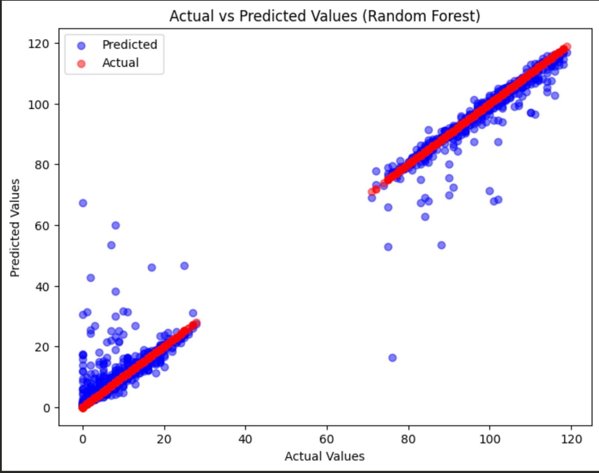

# Predicting Remaining Useful Life (RUL) of Hard Drives

[GOTO:  SETUP](#Installation)

## Submitted File: solution.ipynb

This project focuses on predicting the remaining useful life (RUL) of hard drives using various machine learning models.

## Overview

The goal of this project is to predict the remaining useful life (RUL) of hard drives based on various operational parameters and historical data. By accurately predicting the RUL, proactive maintenance strategies can be implemented to minimize downtime and prevent potential failures.

## Key Steps

1. **Data Preprocessing**:
   - Load the hard drive dataset from a CSV file.
   - Remove columns with all null values.
   - Identify the number of unique hard drives and different types of hard drives in the dataset.
   - Filter the dataset to include only failed hard drives.
   - Calculate the remaining useful life (RUL) for each hard drive based on the difference between the maximum date and the current date.

2. **Feature Engineering**:
   - Rename columns for readability and consistency.
   - Create new features such as:
     - `POWER_ON_HOURS_UTILIZATION`: Ratio of power-on hours to total power-on count.
     - `SPIN_RETRY_TO_POWER_CYCLE_RATIO`: Ratio of spin retry count to power cycle count.
     - `REAllOCATED_SECTOR_ERROR_RATE`: Error rate of reallocated sector count.
     - `CURRENT_PENDING_SECTOR_ERROR_RATE`: Error rate of current pending sector count.
     - `TEMPERATURE_DIFFERENCE`: Difference between temperature readings.
     - `MOVING_AVERAGE_READ_ERROR_RATE`: Moving average of read error rate.
     - `REAllOCATED_SECTOR_ERROR_TREND`: Trend of reallocated sector count errors.
     - `FAILURE_PROBABILITY`: Probability of failure based on historical failure rates.

3. **Drop Unwanted Columns**:
   - Remove raw columns after renaming and feature engineering.

4. **Splitting Data and Training Model**:
   - Split the dataset into training and testing sets.
   - Utilize various regression models for predicting RUL, including Linear Regression, Ridge Regression, Lasso Regression, Decision Tree Regressor, Random Forest Regressor, Gradient Boosting Regressor, Support Vector Machine, K-Nearest Neighbors, Neural Network, and Gaussian Process.
   - Add XGBoost, LightGBM, and CatBoost to the list of classifiers.

5. **Model Evaluation**:
   - Evaluate the performance of each model using regression metrics such as Mean Absolute Error (MAE), Mean Squared Error (MSE), Root Mean Squared Error (RMSE), and R-squared (R2) score.
   - Identify the top-performing models based on R2 score.

6. **Hyperparameter Tuning with Hyperopt**:
   - Perform hyperparameter tuning for the Random Forest Regressor using Hyperopt.
   - Visualize the optimization process and select the best hyperparameters.
   - Train the Random Forest Regressor with the optimized hyperparameters.
   - Evaluate the performance of the tuned model.


## Prerequisites
Before running this notebook, ensure you have the following installed:

Python 3.x
Jupyter Notebook or JupyterLab

## Installation

To set up your environment to run the notebook, follow these steps:

1. Clone the repository (if applicable) or download the notebook to your local machine.

2. Create a virtual environment (optional but recommended):

```
python3 -m venv myenv
source myenv/bin/activate # On Windows, use `myenv\Scripts\activate`
```
3. Install required libraries:


```
pip install -r requirements.txt
```

4. Navigate to the directory containing requirements.txt.

```
cd sct_round2
```

5. Add data file as harddrive/harddrive.csv **OR** replace file path in code (on block 2, "Loading Datset") with your file

```
df = pd.read_csv('harddrive/harddrive.csv')
```


## Usage

Open the notebook in Jupyter Notebook or JupyterLab:

```
jupyter notebook "solution.ipynb"
```

Follow the instructions and code cells within the notebook to run the analysis or prediction models.


## Results
The following image illustrates the importance of various features used (extracted by fitting a random forest regressor) including our engineered features such as MOVING_AVERAGE_READ_ERROR_RATE having very high importance.


The following image illustrates the performance of various regression models in terms of MAE and ranks them accordingly. The top two models are XGBoost & RandomForest and we have experimented over random forest for hyperparameter tuning and further results. (The list is sorted on RMSE: Root mean squared error)


Below are the predicted vs actual results of a low-performing model as signified by the above MAE table, decision tree.


In comparison, the two below images show the predicted vs actual values for a random forest regression with (1st image) and without (2nd) hyperparameter optimisation.



## Conclusion

This project aims to provide insights into the health and remaining lifespan of hard drives using machine learning techniques. By leveraging feature engineering and a variety of regression models, it seeks to optimize the prediction accuracy of the remaining useful life of hard drives, thereby facilitating proactive maintenance and risk management strategies.


